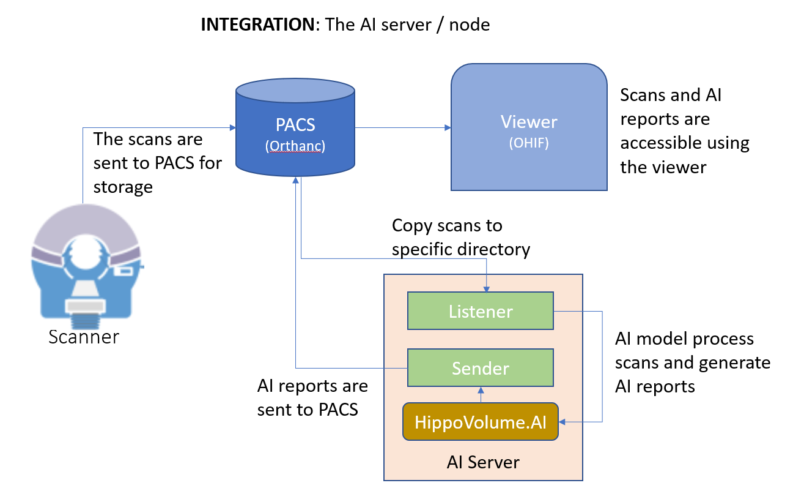
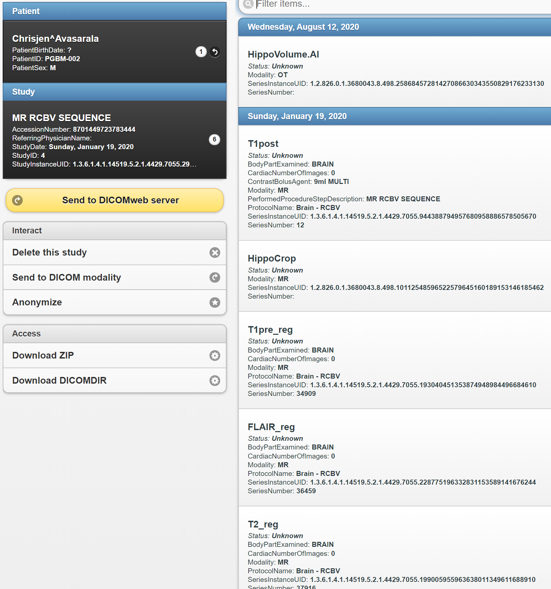

# Integrating AI into Clinical Workflow with Orthanc and OHIF Viewer #

## Creating an AI module for a Clinical Radiological System for Alzheimer disease (AD) treatment.

### Overview

The target of this project is to provide a solution to integrate an AI model to Clinical Workflow to help clinicians provide better patient treratment. 

## 1. System Architecture




The project uses some scripts to simulate the integration showed in the figure above. 

In this simulation, we have 4 parts:

- The Picture Archiving and Communication System (PACS) is represented by [Orthanc](https://medium.com/r/?url=http%3A%2F%2Forthanc-server.com%2F) system.
- The MRI scanner is represented by a script, `send_volume.sh`, that send a volume (radiologic exam) to the clinical PACS. The PACS server is listening to DICOM DIMSE requests on port **4242**. The Orthanc system has a DicomWeb interface that is exposed at port **8042** and can be enabled for visualization. The Orthanc can be [configured](https://medium.com/r/?url=https%3A%2F%2Fbook.orthanc-server.com%2Fusers%2Flua.html) for auto-routing of DICOM flows to send everything it receives to AI server.
- The viewer system is represented by [OHIF](https://medium.com/r/?url=http%3A%2F%2Fohif.org%2F). As commented above, the viewer is connected to Orthanc via DicomWeb using port **3000**.
- The AI server is composed of 3 components: `listener`, `sender` and `HippoVolume.AI`.

    1. the listener is a script, `start_listener.sh`. The script will copy any routed DICOM study to a predefined directory in AI server, creating a sub-directory for each copied study.
    2. The HippoVolume.AI is represented by the `inference_dcm.py` script file. In this project I trained a U-Net model, generating a model.pth file, that infer the probability a patient has AD. The DICE score got 90%. The details about implementation and training the model is out of scope of this article and may be material for another article. When the script is executed, it analyzes the content of AI server directory, where the routed files were copied, calls the model to make the inference of the study, get the results and generates a dcm report.
    3. the sender is a script, `send_results.sh`. The script will send the new modality of the study created in the previous step to PACS. The new modality is now available to clinicians to help take or accelerate critical decisions.

## 2. Putting all together

To put all the packages and scripts working, we need to follow a sequence that is described below. You can find the source code used in this simulation in my GitHub repo, here.
Depending on your configuration, you will need to open a group of terminal window for Orthanc, viewer, listener and one more to execute commands. Note that there is no need to open a terminal if the component is running as a service. In my case, I used 3 terminals as shown in the figure:


- Download and install the Orthanc server from [here](https://medium.com/r/?url=https%3A%2F%2Fwww.orthanc-server.com%2Fdownload.php). Open a terminal and run the command

```sh
bash launch_orthanc.sh
```

or

```sh
./launch_orthanc.sh
```

If you installed Orthanc on Windows, it is already running as a service. You can check if Orthanc is working by running the command

```sh
echoscu localhost 4242 -v
```

- Download and install the OHIF web viewer from [here](https://medium.com/r/?url=https%3A%2F%2Fdocs.ohif.org%2Fdevelopment%2Fgetting-started.html). Open a terminal (I will call viewer) and run the command 

```sh
bash launch_OHIF.sh
```

or

```sh
./launch_OHIF.sh
```

If the viewer is properly installed, after execute the command you will get a similar view as in the figure above. If the viewer is empty, it means there is no scanned files in PACS server yet.

- Testing the visualization. Open a new terminal, that I will call cmd. Go to **deploy_scripts** directory and run the command

```sh
bash send_volume.sh
```

or

```sh
./send_volume.sh
```

The script will simulate the MRI scanner, sending the studies located in **data/TestVolumes** directory to PACS. So, now you can manipulate the study and visualize the details in the OHIF viewer.

- The listener. Open a new terminal, that I will call listener. Go to **deploy_scripts** directory and execute the command

```sh
bash start_listener.sh
```

or

```sh
./start_listener.sh
```

The listener is listening the url **localhost:8042**, the PACS, and will copy the routed patient study images to an AI server directory, that I configured as scanner.

- The HippoVolume.AI. Now, in AI server, we have DICOM images to make inference using the trained CNN model. Go back to cmd terminal and run the command

```python
python ./inference_dcm.py ../scanner
```

The inference takes less than 2 seconds. Basically, the script will load the study, process the inference and generate a dcm report detailing the findings of Alzheimer disease in patient study.

- The sender. Still in the cmd terminal, go to **deploy_scripts** directory and run the command

```sh
bash  send_result.h
```

or

```sh
./send_result.sh
```

The script will send the report to PACS.
At this point, after the AI server has processed the patient study, a new Modality of the patient study was created (figure below). The clinicians now have additional valuable information that can help to take critical decisions, maybe in less time, improving the patient treatment.



## More Interesting Readings

- [Integrating Medical AI with Human Workflow](https://medium.com/datadriveninvestor/integrating-medical-ai-with-human-workflow-994d85e8b63f)
- [5 Options for integrating image-based AI into radiology workflow](https://medium.com/r/?url=https%3A%2F%2Fwww.quantib.com%2Fblog%2F5-options-for-integrating-image-based-ai-into-your-radiology-workflow)
- [How to Integrate AI into Radiology Workflow](https://medium.com/r/?url=https%3A%2F%2Fhealthmanagement.org%2Fc%2Fhospital%2Fissuearticle%2Fhow-to-integrate-ai-into-radiology-workflow)
- [Integrating AI into radiology workflow: levels of research, production, and feedback maturity](https://medium.com/r/?url=https%3A%2F%2Fwww.spiedigitallibrary.org%2Fjournals%2Fjournal-of-medical-imaging%2Fvolume-7%2Fissue-01%2F016502%2FIntegrating-AI-into-radiology-workflow--levels-of-research-production%2F10.1117%2F1.JMI.7.1.016502.full%3FSSO%3D1)
- [Evaluations of AI Applications in Healthcare](https://medium.com/r/?url=https%3A%2F%2Fwww.coursera.org%2Flearn%2Fevaluations-ai-applications-healthcare%2Fhome%2Fwelcome)
- [AI for Healthcare](https://medium.com/r/?url=https%3A%2F%2Fwww.udacity.com%2Fcourse%2Fai-for-healthcare-nanodegree--nd320)
- [AI for Medical Diagnosis](https://medium.com/r/?url=https%3A%2F%2Fwww.coursera.org%2Flearn%2Fai-for-medical-diagnosis)